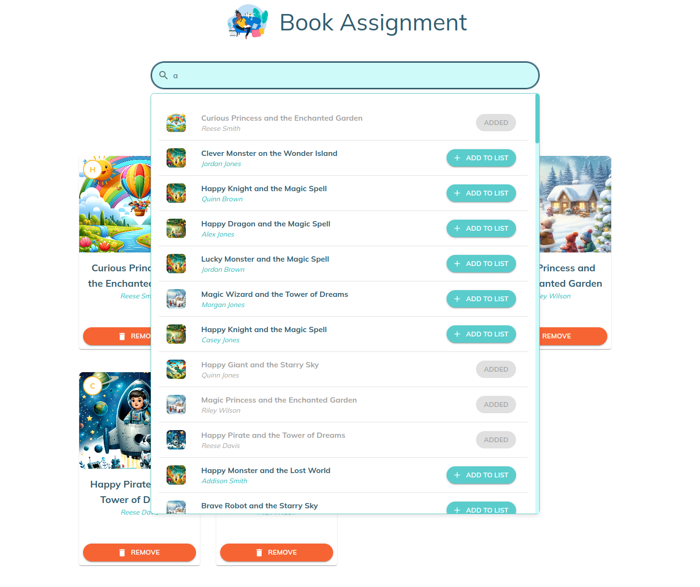

# Book Assignment App FrontEnd Documentation

## Overview

The Book Assignment App allows teachers to search for books by title, add them to a reading list, and manage the reading list effectively. This documentation will guide you through the usage, features, and the code structure of the app.

To view the deployed live version visit this [Link](https://ello-frontend-challenge.onrender.com)

## Features

- **Search for Books**: Teachers can search for books by title using a search bar.
- **View Search Results**: The search results are displayed as a dropdown beneath the search bar.
- **Add Books to Reading List**: Each book in the search results can be added to the reading list.
- **View Reading List**: The reading list displays all books added by the teacher.
- **Remove Books from Reading List**: Each book in the reading list can be removed.
- **Responsive Design**: The app is fully responsive across all screen sizes and utilizes subtle animations to engage the user.
- **State Persistence**: The reading list is persisted across sessions using local storage.
- **User Feedback**: Success messages are shown when books are added or removed from the reading list.

## Usage

### Installation

1. **Clone the repository**:
   ```bash
   git clone https://github.com/Joseph-Mutua/ello-book-assignment.git
   cd ello-book-assignment
   ```

2. **Install dependencies**:
   ```bash
   cd frontend
   npm install
   cd backend
   npm install
   ```

3. **Start the development server**:
 ***Frontend***
   ```bash
   npm run dev
   ```

   ***Backend***
   ```bash
   npm start
   ```


### Running the App

Once the development server is running, open your browser and navigate to `http://localhost:5173/`. You will see the Book Assignment App.

## Components

### App

The `App` component is the root component that integrates all other components. It fetches the list of books and manages the search query and filtered books.

**File**: `src/App.tsx`

### SearchBar

The `SearchBar` component provides an input field for searching books by title. It displays a dropdown with search results.

**Props**:
- `onSearch`: Function to handle the search query.
- `results`: Array of books that match the search query.

**File**: `src/components/SearchBar.tsx`

### SearchResultsDropdown

The `SearchResultsDropdown` component displays the list of search results in a dropdown. Each book in the list has an option to be added to the reading list.

**Props**:
- `results`: Array of books that match the search query.
- `onAdd`: Function to add a book to the reading list.

**File**: `src/components/SearchResultsDropdown.tsx`

### ReadingList

The `ReadingList` component displays the books that have been added to the reading list. Each book can be removed from the list.

**File**: `src/components/ReadingList.tsx`

### BookCard

The `BookCard` component displays the details of a book, including the title, author, and cover photo. It provides buttons to add or remove the book from the reading list.

**Props**:
- `book`: The book object containing title, author, and cover photo URL.
- `onAdd`: Function to add the book to the reading list.
- `onRemove`: Function to remove the book from the reading list.

**File**: `src/components/BookCard.tsx`

## State Management

The app uses `zustand` for state management. The reading list is persisted across sessions using the `persist` middleware.

**File**: `src/store/useReadingListStore.ts`

## GraphQL

The app uses Apollo Client to fetch data from a GraphQL server. The GraphQL query used is:

```graphql
query Books {
  books {
    author
    coverPhotoURL
    readingLevel
    title
  }
}
```

**File**: `src/graphql/queries.ts`

## Styling

The app uses Material-UI for styling and components. Custom styles are defined in the theme file.

**File**: `src/styles/theme.ts`

### Custom Styled Components

- **StyledBox**: Custom styles for the dropdown box.
- **StyledListItem**: Custom styles for the list items in the dropdown.

**Files**:
- `src/styles/StyledBox.ts`
- `src/styles/StyledListItem.ts`

## Accessibility

The app ensures accessibility by providing appropriate `aria-labels` for interactive elements such as buttons and input fields.

## User Feedback

Snackbar alerts are used to provide feedback to the user when a book is added or removed from the reading list.

## Example Workflow

1. **Search for a Book**:
   

   - Type the title of a book in the search bar.
   - The dropdown will display the search results.

2. **Add a Book to the Reading List**:
   - Click the "Add to Reading List" button next to a book in the search results.
   - A success message will appear, and the book will be added to the reading list.

3. **View the Reading List**:
   - Scroll down to view the reading list.
   - The list displays all books that have been added.
    

4. **Remove a Book from the Reading List**:
   - Click the "Remove" button next to a book in the reading list.
   - A success message will appear, and the book will be removed from the reading list.


## License

This project is licensed under the MIT License. See the LICENSE file for more details.

## Contact

For any questions or feedback, please contact ***Mutuaj793@gmail.com***